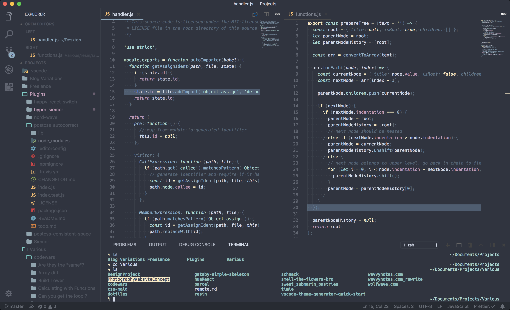

# Welcome to siemor 👋

> The dark VSCode theme you're looking for

## 🚀 Usage

The suggested way to install the theme is from within your VSCode app.

1. Hit `Cmd+Shift+P` (or `Ctrl+Shift+P` depending on your OS)
2. Select 'Install Extension'
3. Type 'siemor'
4. Select & install the theme

Alternatively, you install it from the [Marketplace](https://marketplace.visualstudio.com/items?itemName=dnlytras.siemor)

## 👨‍🎨 In Action

## 🤝 Contributing

Contributions, issues, and feature requests are welcome.
Feel free to check [issues page](https://github.com/dimitrisnl/siemor/issues) if you want to contribute.

## Author

👤 **Dimitrios Lytras <dnlytras@gmail.com>**

* Website: https://dimitrioslytras.com
* Twitter: [@dnlytras](https://twitter.com/dnlytras)
* Github: [@dimitrisnl](https://github.com/dimitrisnl)

## 📝 License

Copyright © 2019 [Dimitrios Lytras](https://github.com/dimitrisnl).
This project is [MIT](https://github.com/dimitrisnl/siemor/blob/master/LICENSE) licensed.

## Show your support

Give a ⭐️ if this project helped you!